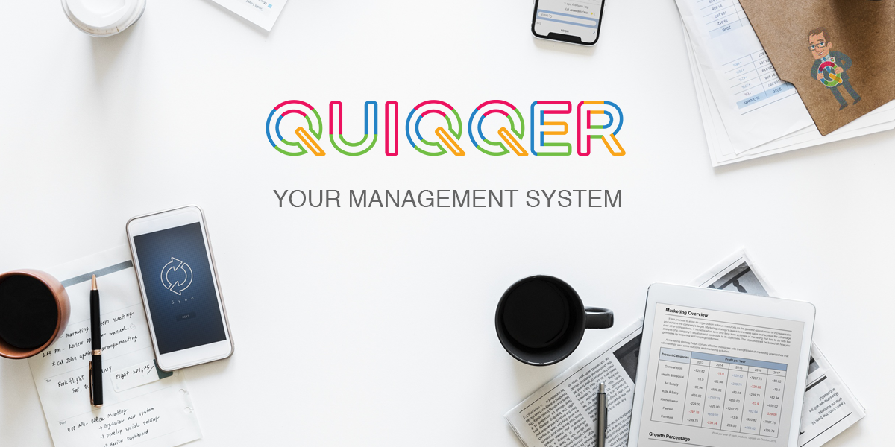

QUIQQER Management System
========

Copyright PCSG OhG

www.pcsg.de
www.quiqqer.com

About QUIQQER
--------

QUIQQER is a modular based management system,
written in PHP / JavaScript from PCSG OhG.

If you search a documentation, please look at www.quiqqer.com.
The online Documentation about QUIQQER can you find at www.quiqqer.com.

On www.quiqqer.com you can find installation instructions, usefull help and more informations about QUIQQER.

Features
--------

- Template System with Layouts
- Internal control system (components) via JavaScript and PHP
- Modular based management system
- Internal Package Management via composer
    - Bridge to npm and bower
       - This makes it possible to access 100000's packages
- Easy XML Module API (https://dev.quiqqer.com/quiqqer/quiqqer/wikis/home#xml-dateien-in-quiqqer)
- Event based system
- Expandable with lots of modules (Gallery, Blog / News, Tags, Payment-, Shop-, Accounting-System and so on...)
- The Main Source is completly open source and free
- The basic system has been all important modules for a professional presence or web project
    - Bricks (own component template system)
    - Cron System
    - Lots of controls (components)
    - E-Mail System (with E-Mail Queue)
    - User / Group / Permission management
    - Multidomain and multi lingual capable
    - Creating multiple projects
    - and many more...
     

Installation
------------

http://doc.quiqqer.com/Installation.html

Contribute
----------

- Issue Tracker: https://dev.quiqqer.com/quiqqer/quiqqer/issues
- Source Code: https://dev.quiqqer.com/quiqqer/quiqqer/tree/master

Support
-------

If you found a mistake or want improvements, 
you are welcome to write an email to support@pcsg.de.

License
-------

GPL-3.0+

Thanks
--------

Parts of QUIQQER are free open-source software and not from us.
We thank all for the nice work.

- Composer ( http://getcomposer.org )
- MooTools ( http://mootools.net/ )
- requirejs ( requirejs.org/ )
- AMD css! plugin curl.js ( https://github.com/cujojs/curl )
- animate.css ( http://daneden.me/animate/ )
- moofx (https://github.com/kamicane/moofx/)
- Font Awesome (http://fontawesome.io/)

- QUIQQER Font: http://fontfabric.com/multicolore-free-fonts/

Last but not least, the QUIQQER UI based on MochaUI.
We decided to reimplement MochaUI.
We implemented the AMD definition and rewrite all controls.

Thanks for all the nice lines of code.
If we forget somebody, please not hesitate and write us an email.

Henning and Moritz from PCSG / QUIQQER
